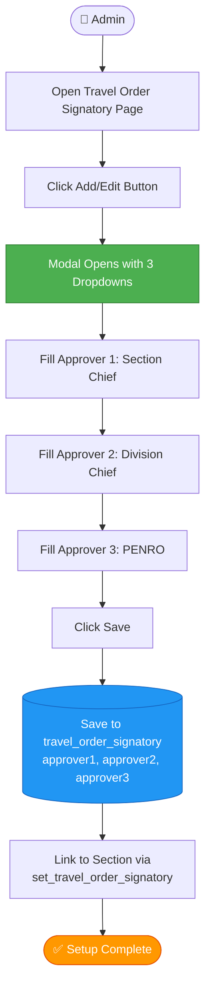
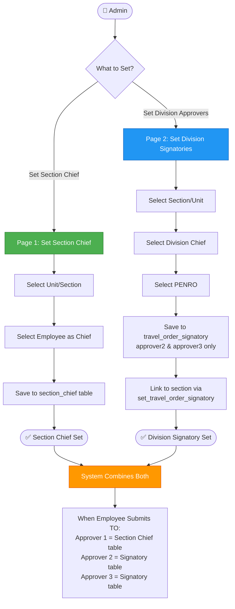
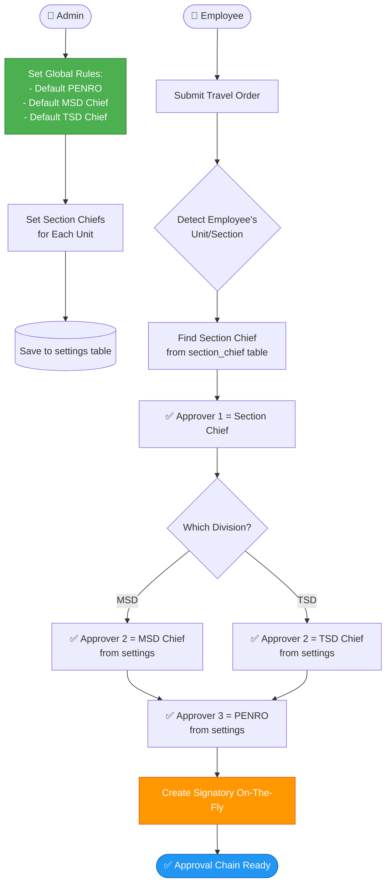

# 🎨 SIGNATORY SETUP - UI/UX OPTIONS

**Date:** December 19, 2025  
**Problem:** Current "Set Travel Order Signatory" only has Approver 1 & 2 fields, but we need 3 approvers

---

## 🚨 CURRENT PROBLEM

### Existing Setup:

```
MSD → Settings → Travel Order Settings → Set Travel Order Signatory
├─ Signatory Name: (e.g., "CDS - Signatory")
├─ Approver 1: [Dropdown] ← Only shows here
└─ Approver 2: [Dropdown] ← Only shows here
```

**Issues:**

-   ❌ No field for Approver 3 (PENRO)
-   ❌ Section Chiefs not visible in the system
-   ❌ Cannot see 3-level approval chain
-   ❌ Database has `approver3` column but UI doesn't support it

---

## 💡 PROPOSED SOLUTIONS

---

## 🎯 **OPTION 1: EXTEND CURRENT UI (SIMPLEST)**

### Concept: Add Approver 3 field to existing page

```
┌────────────────────────────────────────────────────────────────┐
│  Set Travel Order Signatory                             [Add]  │
├────────────────────────────────────────────────────────────────┤
│                                                                 │
│  Existing Signatories                                          │
│  ┌──────────────────────────────────────────────────────────┐ │
│  │ Name          │ Approver 1  │ Approver 2  │ Approver 3  │ │
│  ├──────────────────────────────────────────────────────────┤ │
│  │ CDS-Signatory │ SHYLA ALAH  │ CELSO (TSD) │ ERNESTO     │ │
│  │ ICT-Signatory │ HENRY       │ ABE (MSD)   │ ERNESTO     │ │
│  │ MSD-Signatory │ VON ERIKA   │ ABE (MSD)   │ ERNESTO     │ │
│  │ TSD-Signatory │ CELSO       │ (None)      │ ERNESTO     │ │
│  └──────────────────────────────────────────────────────────┘ │
│                                                                 │
└────────────────────────────────────────────────────────────────┘

┌────────────────────────────────────────────────────────────────┐
│  Add/Edit Signatory Modal                                      │
├────────────────────────────────────────────────────────────────┤
│                                                                 │
│  Signatory Name: *                                             │
│  ┌────────────────────────────────────────────────────────┐   │
│  │ CDS - Signatory                                        │   │
│  └────────────────────────────────────────────────────────┘   │
│                                                                 │
│  👤 Section Chief (Approver 1): *                              │
│  ┌────────────────────────────────────────────────────────┐   │
│  │ ▼ SHYLA ALAH ABUTAN                                    │   │
│  └────────────────────────────────────────────────────────┘   │
│  ℹ️ First approver - Section Chief                            │
│                                                                 │
│  👔 Division Chief (Approver 2): *                             │
│  ┌────────────────────────────────────────────────────────┐   │
│  │ ▼ CELSO ALMAZAN (TSD CHIEF)                           │   │
│  └────────────────────────────────────────────────────────┘   │
│  ℹ️ Second approver - Division Chief (MSD/TSD)                │
│                                                                 │
│  🎯 PENRO (Approver 3): *                                      │
│  ┌────────────────────────────────────────────────────────┐   │
│  │ ▼ ERNESTO TAÑADA (PENRO)                              │   │
│  └────────────────────────────────────────────────────────┘   │
│  ℹ️ Final approver - PENRO (usually same for all)             │
│                                                                 │
│                               [Cancel]  [Save Signatory]       │
│                                                                 │
└────────────────────────────────────────────────────────────────┘
```

### Flow:



### Database Relationship:

```
section_id → set_travel_order_signatory → travel_order_signatory
                                           ├─ approver1: Section Chief
                                           ├─ approver2: Division Chief
                                           └─ approver3: PENRO
```

### ✅ PROS:

-   ✅ Simple - just add 1 dropdown field
-   ✅ All 3 approvers in one place
-   ✅ Minimal code changes
-   ✅ Uses existing database structure
-   ✅ No new tables needed
-   ✅ Easy to understand for admins

### ❌ CONS:

-   ❌ Still ties Section Chief to specific signatory
-   ❌ If admin wants to change Section Chief, must edit signatory
-   ❌ Approver 3 (PENRO) will be repeated in every signatory (redundant)

---

## 🎯 **OPTION 2: SPLIT UI - SEPARATE SECTION CHIEFS**

### Concept: Two separate pages with clear purposes

#### **Page 1: Set Section Chief** (NEW)

```
MSD → Settings → Travel Order Settings → Set Section Chief

┌────────────────────────────────────────────────────────────────┐
│  Set Section Chief                                      [Add]  │
├────────────────────────────────────────────────────────────────┤
│                                                                 │
│  👥 Section Chiefs Assignment                                  │
│  ┌──────────────────────────────────────────────────────────┐ │
│  │ Section/Unit     │ Division │ Chief Name      │ Action  │ │
│  ├──────────────────────────────────────────────────────────┤ │
│  │ CDS Section      │ TSD      │ SHYLA ALAH      │ [Edit]  │ │
│  │ Planning Section │ MSD      │ HENRY MARMOL    │ [Edit]  │ │
│  │ ICT Unit         │ MSD      │ (Not Set)       │ [Set]   │ │
│  │ Admin Section    │ MSD      │ (Not Set)       │ [Set]   │ │
│  │ Budget Section   │ MSD      │ (Not Set)       │ [Set]   │ │
│  └──────────────────────────────────────────────────────────┘ │
│                                                                 │
│  ℹ️ This sets who is the Section Chief for each unit          │
│                                                                 │
└────────────────────────────────────────────────────────────────┘
```

#### **Page 2: Set Division Signatories** (MODIFIED)

```
MSD → Settings → Travel Order Settings → Set Division Signatories

┌────────────────────────────────────────────────────────────────┐
│  Set Division Signatories                               [Add]  │
├────────────────────────────────────────────────────────────────┤
│                                                                 │
│  🏢 Division-Level Approval Chain                              │
│  ┌──────────────────────────────────────────────────────────┐ │
│  │ Section/Unit     │ Division Chief  │ PENRO       │ Action│ │
│  ├──────────────────────────────────────────────────────────┤ │
│  │ CDS Section      │ CELSO (TSD)     │ ERNESTO     │ [Edit]│ │
│  │ Planning Section │ ABE (MSD)       │ ERNESTO     │ [Edit]│ │
│  │ ICT Unit         │ ABE (MSD)       │ ERNESTO     │ [Edit]│ │
│  │ Admin Section    │ ABE (MSD)       │ ERNESTO     │ [Edit]│ │
│  │ Budget Section   │ ABE (MSD)       │ ERNESTO     │ [Edit]│ │
│  └──────────────────────────────────────────────────────────┘ │
│                                                                 │
│  ℹ️ This sets Division Chief and PENRO for each section       │
│                                                                 │
└────────────────────────────────────────────────────────────────┘
```

### Flow:



### Database Relationship:

```
Table 1: section_chief
├─ unitid: 5 (CDS)
└─ employeeid: 123 (Shyla)

Table 2: travel_order_signatory
├─ approver1: NULL (Not used - system looks up section_chief)
├─ approver2: 28 (Division Chief)
└─ approver3: 45 (PENRO)

Table 3: set_travel_order_signatory
├─ sectionid: 5 (CDS)
└─ travelordersignatoryid: 10 (link to above)

When Employee Submits:
1. System finds employee.unitid = 5 (CDS)
2. Looks up section_chief: unitid=5 → Approver 1 = Shyla
3. Looks up set_travel_order_signatory: sectionid=5 → signatory id=10
4. Looks up travel_order_signatory: id=10 → Approver 2 & 3
```

### ✅ PROS:

-   ✅ Clear separation of concerns
-   ✅ Section Chiefs can be changed independently
-   ✅ Division approvers (Approver 2 & 3) managed separately
-   ✅ More flexible for future changes
-   ✅ Easier to understand: "Set chiefs" vs "Set division approvers"
-   ✅ No redundant PENRO in every signatory (can set once per division)

### ❌ CONS:

-   ❌ Two pages to manage (more clicks)
-   ❌ Admin must understand the split
-   ❌ More code changes needed
-   ❌ Requires new controller/views for Section Chief page

---

## 🎯 **OPTION 3: SMART AUTO-DETECTION (ADVANCED)**

### Concept: System auto-detects approvers based on rules

```
MSD → Settings → Travel Order Settings → Approval Rules

┌────────────────────────────────────────────────────────────────┐
│  Set Approval Rules                                            │
├────────────────────────────────────────────────────────────────┤
│                                                                 │
│  🎯 Global Settings                                            │
│  ┌──────────────────────────────────────────────────────────┐ │
│  │                                                            │ │
│  │  Default PENRO (Approver 3 for All):                      │ │
│  │  ┌────────────────────────────────────────────────────┐  │ │
│  │  │ ▼ ERNESTO TAÑADA                                   │  │ │
│  │  └────────────────────────────────────────────────────┘  │ │
│  │                                                            │ │
│  │  Default MSD Chief:                                        │ │
│  │  ┌────────────────────────────────────────────────────┐  │ │
│  │  │ ▼ ABE FRANCISCO                                    │  │ │
│  │  └────────────────────────────────────────────────────┘  │ │
│  │                                                            │ │
│  │  Default TSD Chief:                                        │ │
│  │  ┌────────────────────────────────────────────────────┐  │ │
│  │  │ ▼ CELSO ALMAZAN                                    │  │ │
│  │  └────────────────────────────────────────────────────┘  │ │
│  │                                                            │ │
│  └──────────────────────────────────────────────────────────┘ │
│                                                                 │
│  👥 Section Chiefs                                             │
│  ┌──────────────────────────────────────────────────────────┐ │
│  │ Section/Unit     │ Chief Name      │ Auto Division Chief│ │
│  ├──────────────────────────────────────────────────────────┤ │
│  │ CDS Section      │ SHYLA ALAH      │ → TSD Chief       │ │
│  │ Planning Section │ HENRY MARMOL    │ → MSD Chief       │ │
│  │ ICT Unit         │ VON ERIKA       │ → MSD Chief       │ │
│  └──────────────────────────────────────────────────────────┘ │
│                                                                 │
│  ℹ️ System auto-detects Division Chief based on section       │
│                                                                 │
└────────────────────────────────────────────────────────────────┘
```

### Flow:



### Database Relationship:

```
Table 1: system_settings (NEW)
├─ setting_key: 'default_penro'
├─ setting_value: '45' (employee_id)

Table 2: system_settings
├─ setting_key: 'default_msd_chief'
├─ setting_value: '28' (employee_id)

Table 3: system_settings
├─ setting_key: 'default_tsd_chief'
├─ setting_value: '30' (employee_id)

Table 4: section_chief
├─ unitid: 5 (CDS)
└─ employeeid: 123 (Shyla)

When Employee Submits:
1. System finds employee → unit → section → division
2. Looks up section_chief: Approver 1 = Shyla
3. Checks division = TSD → Approver 2 = TSD Chief from settings
4. Approver 3 = PENRO from settings
5. Creates signatory record automatically (or uses cached one)
```

### ✅ PROS:

-   ✅ Minimal manual setup for admins
-   ✅ Automatic approver detection
-   ✅ Change Division Chief globally (affects all sections)
-   ✅ Change PENRO once (affects entire system)
-   ✅ Very flexible and scalable
-   ✅ Reduces data redundancy

### ❌ CONS:

-   ❌ Most complex to implement
-   ❌ Requires new system_settings table/logic
-   ❌ Less explicit (admins don't see full chain)
-   ❌ May be confusing for admins who want manual control
-   ❌ Requires migration of existing data

---

## 📊 COMPARISON TABLE

| Feature                    | Option 1: Extend UI      | Option 2: Split UI  | Option 3: Auto-Detect  |
| -------------------------- | ------------------------ | ------------------- | ---------------------- |
| **Ease of Implementation** | ⭐⭐⭐⭐⭐ Very Easy     | ⭐⭐⭐ Moderate     | ⭐ Complex             |
| **Code Changes Required**  | Minimal (1 file)         | Moderate (new page) | Major (new system)     |
| **Admin Ease of Use**      | ⭐⭐⭐⭐ Simple          | ⭐⭐⭐ Clear        | ⭐⭐ Requires training |
| **Flexibility**            | ⭐⭐ Low                 | ⭐⭐⭐⭐ High       | ⭐⭐⭐⭐⭐ Very High   |
| **Data Redundancy**        | ❌ High (PENRO repeated) | ✅ Medium           | ✅ Low                 |
| **Future Maintenance**     | ⭐⭐⭐ OK                | ⭐⭐⭐⭐ Good       | ⭐⭐⭐⭐⭐ Excellent   |
| **Database Changes**       | None (use existing)      | Minimal (new table) | Major (settings table) |
| **Time to Implement**      | 30 minutes               | 2-3 hours           | 5-6 hours              |
| **Risk Level**             | ✅ Low                   | ✅ Low              | ⚠️ Medium              |

---

## 🎯 MY RECOMMENDATION: **OPTION 1 (Short-term) → OPTION 2 (Long-term)**

### Phase 1: Quick Fix (Today)

**Use OPTION 1** - Extend current UI with Approver 3 field

-   ✅ Fastest solution (30 minutes)
-   ✅ Gets system working immediately
-   ✅ Minimal risk
-   ✅ Uses existing database structure

### Phase 2: Proper Refactor (Next Week)

**Upgrade to OPTION 2** - Split into two pages

-   ✅ Better user experience
-   ✅ Clear separation of concerns
-   ✅ Easier to maintain long-term
-   ✅ More professional

### Phase 3: Advanced (Future Enhancement)

**Consider OPTION 3** if you need:

-   Multiple PENRO (different regions)
-   Frequent Division Chief changes
-   Complex approval hierarchies
-   Enterprise-level management

---

## 🚀 IMPLEMENTATION ROADMAP

### If You Choose **OPTION 1** (RECOMMENDED NOW):

1. **Modify View** (5 minutes)

    - Add Approver 3 dropdown to form
    - Add Approver 3 column to table

2. **Update Controller** (10 minutes)

    - Add `approver3` to validation
    - Add `approver3` to store/update methods

3. **Test** (15 minutes)
    - Create signatory with 3 approvers
    - Submit TO and verify approval flow
    - Check sidebar visibility

**Total Time: ~30 minutes**

---

### If You Choose **OPTION 2** (BETTER LONG-TERM):

1. **Create Migration** (30 minutes)

    - `section_chief` table
    - Seed with existing data

2. **Create Model** (15 minutes)

    - `SectionChief.php` with relationships

3. **Create Controller** (1 hour)

    - `SectionChiefController.php`
    - CRUD operations
    - AJAX endpoints

4. **Create Views** (1 hour)

    - `set-section-chief/index.blade.php`
    - Modals for add/edit

5. **Modify Existing** (30 minutes)

    - Update Travel Order Signatory view (remove/hide Approver 1)
    - Update TravelOrderController to lookup Section Chief

6. **Test** (30 minutes)
    - Full end-to-end testing

**Total Time: ~3.5 hours**

---

## ❓ QUESTIONS FOR YOU

Before I start implementation, please answer:

1. **Which option do you prefer?**

    - Option 1 (quick fix - add Approver 3 to current page)
    - Option 2 (better UX - split into 2 pages)
    - Option 3 (advanced - auto-detection)

2. **Timeline Priority?**

    - Need it working TODAY → Option 1
    - Can wait 1-2 days for better solution → Option 2
    - Planning for future, have time → Option 3

3. **Should PENRO always be the same person?**

    - Yes, always Ernesto Tañada → Consider default setting
    - No, different PENRO per section → Keep dropdown

4. **Do Division Chiefs change frequently?**
    - Yes, often → Option 2 or 3 better
    - No, rarely → Option 1 is fine

---

**Piliin mo kung alin ang gusto mo, then I'll implement it! 🚀**
