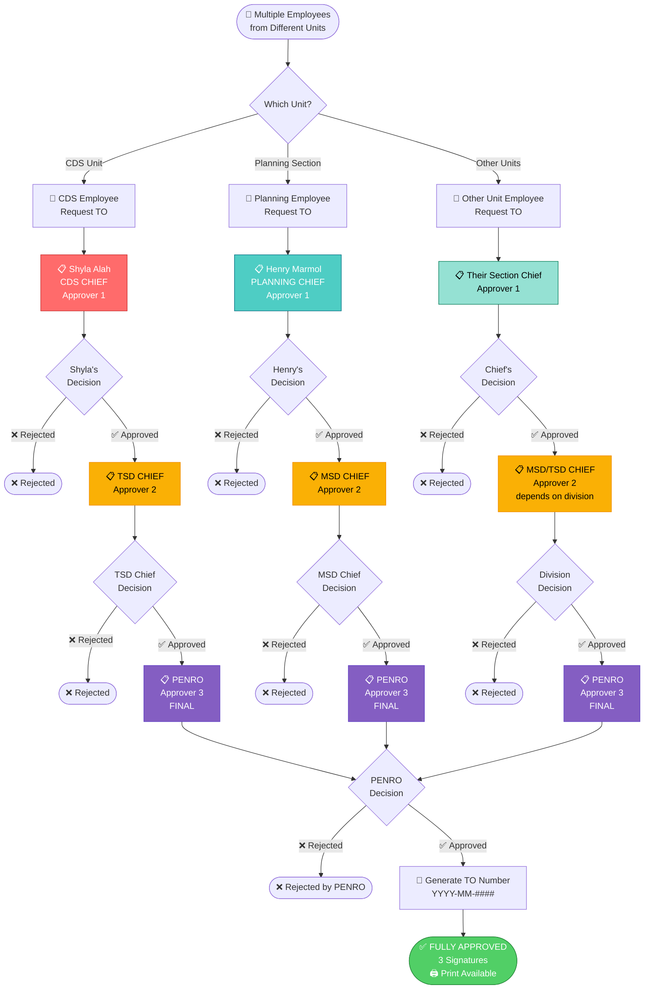
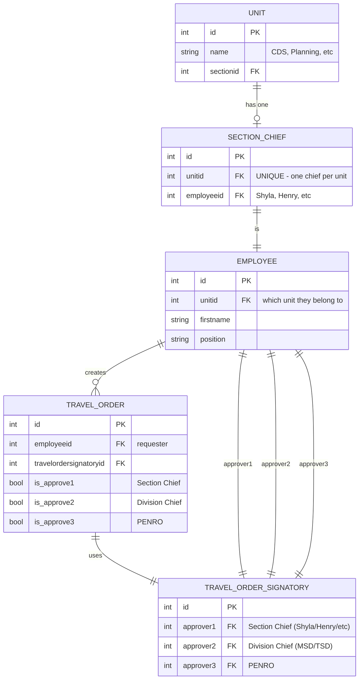
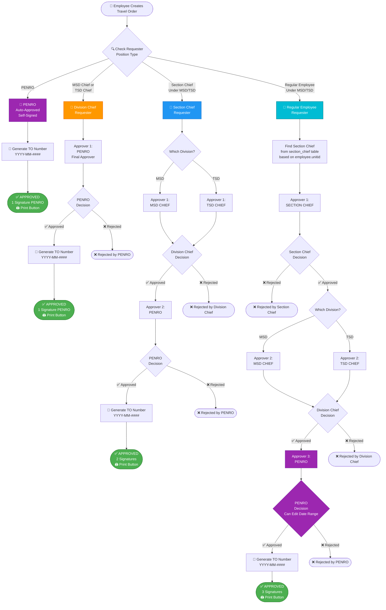
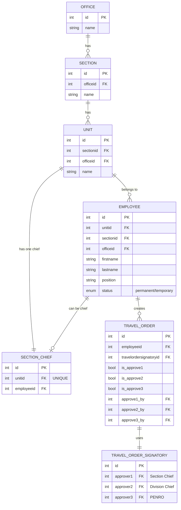

# 🚀 Travel Order System - CURRENT 3-LEVEL FLOW (WORKING)

**Date:** December 19, 2025  
**Status:** ✅ IMPLEMENTED & WORKING

---

## 🎯 CURRENT SYSTEM ARCHITECTURE

### ✅ MULTIPLE SECTION CHIEFS (Each Unit Has Own Chief)

**CURRENT WORKING SETUP:**

```
Set Section Chief Page
├── CDS Section → Shyla Alah Abutan (CDS Chief)
├── Planning Section → Henry Marmol (Planning Chief)
├── Accounting Section → (Not Set)
├── Budget Section → (Not Set)
└── ... (13 total units/sections)
```

**KEY POINTS:**

-   ✅ **Each unit/section can have 1 Section Chief**
-   ✅ **Multiple Section Chiefs exist simultaneously** (currently: Shyla + Henry)
-   ✅ **Each Section Chief gets "T.O. Request(s)" in sidebar**
-   ✅ **Each Section Chief sees ONLY their unit's employee requests**

---

## 📊 COMPLETE FLOW DIAGRAM (WORKING)



---

## 🔑 HOW IT WORKS (CURRENT IMPLEMENTATION)

### 1️⃣ **Employee Submits TO**

```php
// System checks employee's unit
$employee = Employee::find($requesterId);
$unitid = $employee->unitid; // e.g., CDS = unit 5, Planning = unit 2
```

### 2️⃣ **System Finds Section Chief**

```php
// Look up section_chief table
$sectionChief = SectionChief::where('unitid', $unitid)->first();
// Result:
// - CDS unit → Shyla (ID 123)
// - Planning unit → Henry (ID 24)
```

### 3️⃣ **System Finds Division Chief**

```php
// Based on employee's section/division
$section = Section::find($employee->sectionid);
if ($section->name contains 'TSD') {
    $divisionChief = TSD_CHIEF_ID; // for CDS employees
} else {
    $divisionChief = MSD_CHIEF_ID; // for Planning employees
}
```

### 4️⃣ **System Creates Signatory Chain**

```php
TravelOrderSignatory::create([
    'approver1' => $sectionChief->employeeid, // Shyla OR Henry
    'approver2' => $divisionChief,            // TSD Chief OR MSD Chief
    'approver3' => PENRO_ID                   // Always PENRO
]);
```

---

## 📋 REAL EXAMPLE FLOWS

### Example 1: CDS Employee Submits TO

```
👤 John Paul (CDS Employee)
↓ Submits Travel Order
↓
📋 Shyla Alah Abutan (CDS CHIEF - Approver 1)
   ├─ Sees: "T.O. Request(s)" badge = 3
   ├─ Opens: Travel Order Request page
   ├─ Table shows: ONLY CDS employees' requests
   └─ Approves ✅
↓
📋 TSD CHIEF (Approver 2)
   └─ Approves ✅
↓
📋 ERNESTO TAÑADA (PENRO - Approver 3)
   └─ Approves ✅ → Generates TO Number
↓
✅ FULLY APPROVED
   3 Signatures: Shyla → TSD Chief → PENRO
   🖨️ Print button available
```

### Example 2: Planning Employee Submits TO

```
👤 Maria Santos (Planning Employee)
↓ Submits Travel Order
↓
📋 Henry Marmol (PLANNING CHIEF - Approver 1)
   ├─ Sees: "T.O. Request(s)" badge = 2
   ├─ Opens: Travel Order Request page
   ├─ Table shows: ONLY Planning employees' requests
   └─ Approves ✅
↓
📋 MSD CHIEF (Approver 2)
   └─ Approves ✅
↓
📋 ERNESTO TAÑADA (PENRO - Approver 3)
   └─ Approves ✅ → Generates TO Number
↓
✅ FULLY APPROVED
   3 Signatures: Henry → MSD Chief → PENRO
   🖨️ Print button available
```

### Example 3: Accounting Employee (No Chief Set)

```
👤 Pedro Garcia (Accounting Employee)
↓ Submits Travel Order
↓
❌ ERROR: "No Section Chief assigned for Accounting Section!"
   → Cannot proceed until admin sets Accounting Chief
```

---

## 👥 SIDEBAR "T.O. Request(s)" VISIBILITY

### Who Sees the Menu?

```sql
-- AppServiceProvider logic
$emp = current_user's employee;

-- Check if user is approver1, approver2, OR approver3
$sigAsA1 = TravelOrderSignatory::where('approver1', $emp->id)->pluck('id');
$sigAsA2 = TravelOrderSignatory::where('approver2', $emp->id)->pluck('id');
$sigAsA3 = TravelOrderSignatory::where('approver3', $emp->id)->pluck('id');

if ($sigAsA1->isNotEmpty() || $sigAsA2->isNotEmpty() || $sigAsA3->isNotEmpty()) {
    $showTO = true; // Show "T.O. Request(s)" menu
}
```

**Current Users Who See Menu:**

-   ✅ **Shyla Alah** (CDS Chief - Approver 1 for CDS signatory)
-   ✅ **Henry Marmol** (Planning Chief - Approver 1 for Planning signatory)
-   ✅ **TSD Chief** (Approver 2 for all TSD sections)
-   ✅ **MSD Chief** (Approver 2 for all MSD sections)
-   ✅ **ERNESTO TAÑADA** (PENRO - Approver 3 for ALL signatories)

---

## 🔢 BADGE COUNTS (CURRENT LOGIC)

```php
// Each user sees ONLY their pending requests

// For Shyla (CDS Chief):
$pending = TravelOrder::whereIn('travelordersignatoryid', $shyla_signatories)
    ->where('is_approve1', false)  // Waiting for her
    ->count();
// Badge shows: 3 (CDS employees' pending TOs)

// For Henry (Planning Chief):
$pending = TravelOrder::whereIn('travelordersignatoryid', $henry_signatories)
    ->where('is_approve1', false)  // Waiting for him
    ->count();
// Badge shows: 2 (Planning employees' pending TOs)

// For MSD Chief:
$pending = TravelOrder::whereIn('travelordersignatoryid', $msd_signatories)
    ->where('is_approve1', true)   // Section Chief done
    ->where('is_approve2', false)  // Waiting for MSD Chief
    ->count();
// Badge shows: 5 (All MSD sections' TOs)

// For PENRO:
$pending = TravelOrder::whereIn('travelordersignatoryid', $penro_signatories)
    ->where('is_approve1', true)   // Section Chief done
    ->where('is_approve2', true)   // Division Chief done
    ->where('is_approve3', false)  // Waiting for PENRO
    ->count();
// Badge shows: 3 (All sections' TOs ready for final approval)
```

---

## 🗄️ DATABASE RELATIONSHIPS (CURRENT)



---

## 📊 CURRENT SET SECTION CHIEF TABLE

| Unit/Section         | Division | Current Chief            | Status  | Who Sees TOs            |
| -------------------- | -------- | ------------------------ | ------- | ----------------------- |
| **CDS Section**      | TSD      | ✅ **Shyla Alah Abutan** | Active  | CDS employees only      |
| **Planning Section** | MSD      | ✅ **Henry Marmol**      | Active  | Planning employees only |
| Accounting Section   | MSD      | ⚠️ Not Set               | Pending | N/A                     |
| Admin Section        | MSD      | ⚠️ Not Set               | Pending | N/A                     |
| Budget Section       | MSD      | ⚠️ Not Set               | Pending | N/A                     |
| ...                  | ...      | ...                      | ...     | ...                     |

---

## ✅ WHAT'S WORKING NOW

1. ✅ **Multiple Section Chiefs** dapat i-set (13 units total)
2. ✅ **Each Section Chief** - sariling queue ng requests
3. ✅ **Badge counts** - accurate per approver level
4. ✅ **Auto-routing** - CDS → TSD Chief, Planning → MSD Chief
5. ✅ **3-level approval** - Section → Division → PENRO
6. ✅ **TO Number** - generated on PENRO approval
7. ✅ **Print with 3 signatures** - Approver2 (left), Approver3 (right), Approver1 (middle small)
8. ✅ **Toast notifications** - when new requests arrive
9. ✅ **No auto-reload** - manual refresh only

---

## 🎯 SUMMARY

**CURRENT ARCHITECTURE = MULTI-TENANT SECTION CHIEFS**

-   Each unit can have 1 Section Chief
-   Each Section Chief sees only THEIR unit's requests
-   Each Section Chief → forwards to correct Division Chief (MSD/TSD)
-   All paths → end at PENRO for final approval
-   System supports **unlimited Section Chiefs** (one per unit)

**Shyla at Henry ay magkahiwalay na proseso:**

-   Shyla → CDS employees → TSD Chief → PENRO
-   Henry → Planning employees → MSD Chief → PENRO

**Tama na ba ang visualization na ito?** ✅

---

## 📋 WHAT'S NEW?

### OLD FLOW (Current - 2 Levels):

```
Regular Employee → Division Chief (MSD/TSD) → PENRO
```

### NEW FLOW (Position-Based Conditional Approval):

**4 Different Approval Paths:**

1. **PENRO** (Auto-Approved):

    ```
    PENRO → Auto-Approved (Self-Signed) → 1 Signature
    ```

2. **Division Chief** (MSD/TSD Chief):

    ```
    Division Chief → PENRO → 1 Signature (PENRO only)
    ```

3. **Section Chief** (Under MSD/TSD):

    ```
    Section Chief → Division Chief (MSD/TSD) → PENRO → 2 Signatures
    ```

4. **Regular Employee** (Under MSD/TSD):
    ```
    Regular Employee → Section Chief → Division Chief (MSD/TSD) → PENRO → 3 Signatures
    ```

**KEY CHANGES:**

-   ✅ **Position-based approval routing** (auto-detect based on employee position)
-   ✅ PENRO can **edit date range** of any travel order
-   ✅ Different signature counts based on position (1, 2, or 3 signatures)
-   ✅ TO Number generated after final approval
-   ✅ Print button appears when fully approved
-   ✅ Only **PERMANENT** employees can be Section Chiefs

---

## 🎯 COMPLETE APPROVAL FLOW (UPDATED)



---

## 🗄️ DATABASE STRUCTURE

### Current Tables:

```
office (MSD, TSD, etc.)
  ↓
section (divisions under office)
  ↓
unit (sections/units under division)
  ↓
employee (staff members)
```

### NEW TABLE NEEDED: `section_chief`

```sql
CREATE TABLE `section_chief` (
  `id` INT(11) NOT NULL AUTO_INCREMENT,
  `unitid` INT(11) NOT NULL COMMENT 'Link to unit table',
  `employeeid` INT(11) NOT NULL COMMENT 'Link to employee table (Chief)',
  `created_at` TIMESTAMP NULL DEFAULT NULL,
  `updated_at` TIMESTAMP NULL DEFAULT NULL,
  PRIMARY KEY (`id`),
  UNIQUE KEY `unique_unit_chief` (`unitid`),
  KEY `fk_unitid` (`unitid`),
  KEY `fk_employeeid` (`employeeid`),
  CONSTRAINT `fk_section_chief_unit` FOREIGN KEY (`unitid`) REFERENCES `unit` (`id`) ON DELETE CASCADE,
  CONSTRAINT `fk_section_chief_employee` FOREIGN KEY (`employeeid`) REFERENCES `employee` (`id`) ON DELETE CASCADE
) ENGINE=InnoDB DEFAULT CHARSET=utf8mb4;
```

**Explanation:**

-   One chief per unit
-   `unitid` is unique (1 unit = 1 chief only)
-   Links to employee who must be PERMANENT

---

## 📊 APPROVAL LOGIC TABLE (UPDATED)

| Requester Type             | Skip Approver 1? | Approver 1       | Approver 2   | Approver 3      | Total Signatures | Can Edit Date? |
| -------------------------- | ---------------- | ---------------- | ------------ | --------------- | ---------------- | -------------- |
| **PENRO**                  | ✅               | ❌               | ❌           | ✅ PENRO (Self) | **1**            | ✅ Yes (Self)  |
| **Division Chief (MSD)**   | ✅               | ❌               | ❌           | ✅ PENRO        | **1**            | ❌ No          |
| **Division Chief (TSD)**   | ✅               | ❌               | ❌           | ✅ PENRO        | **1**            | ❌ No          |
| **Section Chief (MSD)**    | ✅               | ❌               | ✅ MSD Chief | ✅ PENRO        | **2**            | ❌ No          |
| **Section Chief (TSD)**    | ✅               | ❌               | ✅ TSD Chief | ✅ PENRO        | **2**            | ❌ No          |
| **Regular Employee (MSD)** | ❌               | ✅ Section Chief | ✅ MSD Chief | ✅ PENRO        | **3**            | ❌ No          |
| **Regular Employee (TSD)** | ❌               | ✅ Section Chief | ✅ TSD Chief | ✅ PENRO        | **3**            | ❌ No          |

**Special Features:**

-   ⭐ **PENRO can edit date range** of ANY travel order (even from others)
-   🔢 **TO Number** generated ONLY after final approval (PENRO approves)
-   🖨️ **Print Button** appears ONLY when fully approved with TO Number



---

## 🎨 ADMIN UI FLOW - Set Section Chief

### Navigation:

```
Admin Dashboard
  └── MSD Management
      └── Settings
          └── Travel Order Settings
              ├── Travel Order Signatory (existing)
              ├── Set Travel Order Signatory (existing)
              └── 🆕 Set Section Chief (NEW)
```

### UI Layout - Option 1 (Recommended):

```
┌─────────────────────────────────────────────────────────────┐
│  Set Section Chief                                    [Add] │
├─────────────────────────────────────────────────────────────┤
│                                                               │
│  Table View - All Units with Chiefs                         │
│  ┌──────────────────────────────────────────────────────┐  │
│  │ Unit/Section      │ Division │ Current Chief  │ Action│  │
│  ├──────────────────────────────────────────────────────┤  │
│  │ Planning Section  │ MSD      │ Juan Dela Cruz │ Edit │  │
│  │ CDS Unit          │ TSD      │ Pedro Santos   │ Edit │  │
│  │ Finance Section   │ MSD      │ (Not Set)      │ Set  │  │
│  │ Legal Unit        │ TSD      │ Maria Garcia   │ Edit │  │
│  └──────────────────────────────────────────────────────┘  │
│                                                               │
└─────────────────────────────────────────────────────────────┘

┌─────────────────────────────────────────────────────────────┐
│  Add/Edit Section Chief Modal                               │
├─────────────────────────────────────────────────────────────┤
│                                                               │
│  Select Unit/Section: *                                      │
│  ┌─────────────────────────────────────────────────────┐    │
│  │ ▼ Planning Section (MSD)                            │    │
│  │   - Planning Section (MSD)                          │    │
│  │   - Finance Section (MSD)                           │    │
│  │   - CDS Unit (TSD)                                  │    │
│  │   - Legal Unit (TSD)                                │    │
│  └─────────────────────────────────────────────────────┘    │
│                                                               │
│  Select Employee as Chief: *                                 │
│  ┌─────────────────────────────────────────────────────┐    │
│  │ ▼ Juan Dela Cruz (Permanent - Planning)            │    │
│  │   - Juan Dela Cruz (Permanent - Planning)          │    │
│  │   - Maria Santos (Permanent - Planning)            │    │
│  │   - Pedro Garcia (Permanent - Planning)            │    │
│  └─────────────────────────────────────────────────────┘    │
│                                                               │
│  ℹ️ Only PERMANENT employees from selected unit shown       │
│                                                               │
│                              [Cancel]  [Save Section Chief]  │
│                                                               │
└─────────────────────────────────────────────────────────────┘
```

### UI Flow Steps:

1. **Admin clicks "Add" or "Edit" button**
2. **Modal opens with 2 dropdowns:**
    - **Dropdown 1: Select Unit/Section**
        - Shows all units from `unit` table
        - Display format: `{unit.name} ({section.name} - {office.name})`
        - Example: "Planning Section (MSD)"
3. **When unit is selected:**

    - **Dropdown 2 activates automatically**
    - Filters employees where:
        - `employee.unitid = selected_unit.id`
        - `employee.status = 'permanent'` (only permanent)
    - Display format: `{firstname} {lastname} (Permanent - {unit.name})`
    - Example: "Juan Dela Cruz (Permanent - Planning)"

4. **Admin selects employee and clicks "Save"**
5. **System saves to `section_chief` table**
6. **Table refreshes showing new chief**

---

## 💻 ADMIN UI CODE STRUCTURE

### Blade View: `resources/views/msd-panel/travel-order-settings/set-section-chief/index.blade.php`

```blade
@extends('layouts.app')

@section('content')
<div class="content-wrapper">
    <div class="content-header">
        <div class="container-fluid">
            <h1 class="m-0">Set Section Chief</h1>
        </div>
    </div>

    <section class="content">
        <div class="container-fluid">
            <div class="card">
                <div class="card-header">
                    <h3 class="card-title">Manage Section Chiefs per Unit</h3>
                    <button class="btn btn-primary float-right" data-toggle="modal" data-target="#addChiefModal">
                        <i class="fas fa-plus"></i> Add Section Chief
                    </button>
                </div>
                <div class="card-body">
                    <table class="table table-bordered">
                        <thead>
                            <tr>
                                <th>Unit/Section</th>
                                <th>Division</th>
                                <th>Office</th>
                                <th>Current Chief</th>
                                <th>Status</th>
                                <th>Actions</th>
                            </tr>
                        </thead>
                        <tbody>
                            @foreach($units as $unit)
                            <tr>
                                <td>{{ $unit->name }}</td>
                                <td>{{ $unit->Section->name ?? 'N/A' }}</td>
                                <td>{{ $unit->Office->name ?? 'N/A' }}</td>
                                <td>
                                    @if($unit->sectionChief)
                                        <strong>{{ $unit->sectionChief->employee->firstname }} {{ $unit->sectionChief->employee->lastname }}</strong>
                                        <br>
                                        <small class="text-muted">{{ $unit->sectionChief->employee->position }}</small>
                                    @else
                                        <span class="text-danger">Not Set</span>
                                    @endif
                                </td>
                                <td>
                                    @if($unit->sectionChief)
                                        <span class="badge badge-success">Active</span>
                                    @else
                                        <span class="badge badge-warning">Pending</span>
                                    @endif
                                </td>
                                <td>
                                    @if($unit->sectionChief)
                                        <button class="btn btn-sm btn-warning edit-chief"
                                                data-id="{{ $unit->sectionChief->id }}"
                                                data-unitid="{{ $unit->id }}"
                                                data-employeeid="{{ $unit->sectionChief->employeeid }}">
                                            <i class="fas fa-edit"></i> Edit
                                        </button>
                                        <form method="POST" action="{{ route('section-chief.destroy', $unit->sectionChief->id) }}" style="display:inline">
                                            @csrf
                                            @method('DELETE')
                                            <button type="submit" class="btn btn-sm btn-danger" onclick="return confirm('Remove this chief?')">
                                                <i class="fas fa-trash"></i> Remove
                                            </button>
                                        </form>
                                    @else
                                        <button class="btn btn-sm btn-primary set-chief" data-unitid="{{ $unit->id }}">
                                            <i class="fas fa-user-tie"></i> Set Chief
                                        </button>
                                    @endif
                                </td>
                            </tr>
                            @endforeach
                        </tbody>
                    </table>
                </div>
            </div>
        </div>
    </section>
</div>

<!-- Modal -->
<div class="modal fade" id="addChiefModal">
    <div class="modal-dialog">
        <div class="modal-content">
            <form method="POST" action="{{ route('section-chief.store') }}" id="chiefForm">
                @csrf
                <input type="hidden" name="id" id="chief_id">

                <div class="modal-header">
                    <h4 class="modal-title" id="modalTitle">Add Section Chief</h4>
                    <button type="button" class="close" data-dismiss="modal">&times;</button>
                </div>

                <div class="modal-body">
                    <div class="form-group">
                        <label>Select Unit/Section <span class="text-danger">*</span></label>
                        <select name="unitid" id="unitid" class="form-control" required>
                            <option value="">-- Select Unit --</option>
                            @foreach($units as $unit)
                                <option value="{{ $unit->id }}"
                                        data-sectionid="{{ $unit->sectionid }}"
                                        data-officeid="{{ $unit->officeid }}">
                                    {{ $unit->name }} ({{ $unit->Section->name ?? 'N/A' }} - {{ $unit->Office->name ?? 'N/A' }})
                                </option>
                            @endforeach
                        </select>
                    </div>

                    <div class="form-group">
                        <label>Select Employee as Chief <span class="text-danger">*</span></label>
                        <select name="employeeid" id="employeeid" class="form-control" required disabled>
                            <option value="">-- Select Unit First --</option>
                        </select>
                        <small class="form-text text-muted">
                            <i class="fas fa-info-circle"></i> Only PERMANENT employees from selected unit are shown
                        </small>
                    </div>
                </div>

                <div class="modal-footer">
                    <button type="button" class="btn btn-secondary" data-dismiss="modal">Cancel</button>
                    <button type="submit" class="btn btn-primary">Save Section Chief</button>
                </div>
            </form>
        </div>
    </div>
</div>

@endsection

@section('scripts')
<script>
$(document).ready(function() {
    // When unit is selected, load employees
    $('#unitid').change(function() {
        var unitid = $(this).val();
        var employeeDropdown = $('#employeeid');

        if(unitid) {
            // AJAX to get employees
            $.ajax({
                url: '/api/employees-by-unit/' + unitid,
                type: 'GET',
                success: function(data) {
                    employeeDropdown.empty();
                    employeeDropdown.append('<option value="">-- Select Employee --</option>');

                    $.each(data, function(index, employee) {
                        employeeDropdown.append(
                            '<option value="' + employee.id + '">' +
                            employee.firstname + ' ' + employee.lastname +
                            ' (Permanent - ' + employee.unit.name + ')' +
                            '</option>'
                        );
                    });

                    employeeDropdown.prop('disabled', false);
                }
            });
        } else {
            employeeDropdown.empty();
            employeeDropdown.append('<option value="">-- Select Unit First --</option>');
            employeeDropdown.prop('disabled', true);
        }
    });

    // Edit chief
    $('.edit-chief').click(function() {
        var id = $(this).data('id');
        var unitid = $(this).data('unitid');
        var employeeid = $(this).data('employeeid');

        $('#chief_id').val(id);
        $('#unitid').val(unitid).trigger('change');

        setTimeout(function() {
            $('#employeeid').val(employeeid);
        }, 500);

        $('#modalTitle').text('Edit Section Chief');
        $('#chiefForm').attr('action', '/section-chief/' + id);
        $('#chiefForm').append('<input type="hidden" name="_method" value="PUT">');
        $('#addChiefModal').modal('show');
    });

    // Set chief (from table)
    $('.set-chief').click(function() {
        var unitid = $(this).data('unitid');
        $('#unitid').val(unitid).trigger('change');
        $('#addChiefModal').modal('show');
    });
});
</script>
@endsection
```

---

## 🔧 BACKEND CODE STRUCTURE

### 1. Create Model: `app/Models/SectionChief.php`

```php
<?php

namespace App\Models;

use Illuminate\Database\Eloquent\Factories\HasFactory;
use Illuminate\Database\Eloquent\Model;

class SectionChief extends Model
{
    use HasFactory;

    protected $table = 'section_chief';

    protected $fillable = [
        'unitid',
        'employeeid',
    ];

    // Relationships
    public function unit()
    {
        return $this->belongsTo(Unit::class, 'unitid', 'id');
    }

    public function employee()
    {
        return $this->belongsTo(Employee::class, 'employeeid', 'id');
    }
}
```

### 2. Update `Unit` Model: `app/Models/Unit.php`

```php
// Add this relationship
public function sectionChief()
{
    return $this->hasOne(SectionChief::class, 'unitid', 'id');
}
```

### 3. Create Controller: `app/Http/Controllers/Msd/SectionChiefController.php`

```php
<?php

namespace App\Http\Controllers\Msd;

use App\Http\Controllers\Controller;
use App\Models\SectionChief;
use App\Models\Unit;
use App\Models\Employee;
use Illuminate\Http\Request;

class SectionChiefController extends Controller
{
    public function index()
    {
        $units = Unit::with(['Section', 'Office', 'sectionChief.employee'])
                     ->orderBy('name', 'asc')
                     ->get();

        return view('msd-panel.travel-order-settings.set-section-chief.index', compact('units'));
    }

    public function store(Request $request)
    {
        $request->validate([
            'unitid' => 'required|exists:unit,id',
            'employeeid' => 'required|exists:employee,id',
        ]);

        // Check if employee is permanent
        $employee = Employee::find($request->employeeid);
        if (strtolower($employee->status ?? '') !== 'permanent') {
            return back()->with('error', 'Only PERMANENT employees can be Section Chiefs!');
        }

        // Check if unit already has a chief
        $existing = SectionChief::where('unitid', $request->unitid)->first();
        if ($existing) {
            return back()->with('error', 'This unit already has a Section Chief! Use Edit instead.');
        }

        SectionChief::create([
            'unitid' => $request->unitid,
            'employeeid' => $request->employeeid,
        ]);

        return back()->with('message', 'Section Chief assigned successfully!');
    }

    public function update(Request $request, $id)
    {
        $request->validate([
            'unitid' => 'required|exists:unit,id',
            'employeeid' => 'required|exists:employee,id',
        ]);

        $employee = Employee::find($request->employeeid);
        if (strtolower($employee->status ?? '') !== 'permanent') {
            return back()->with('error', 'Only PERMANENT employees can be Section Chiefs!');
        }

        $sectionChief = SectionChief::findOrFail($id);
        $sectionChief->update([
            'unitid' => $request->unitid,
            'employeeid' => $request->employeeid,
        ]);

        return back()->with('message', 'Section Chief updated successfully!');
    }

    public function destroy($id)
    {
        $sectionChief = SectionChief::findOrFail($id);
        $sectionChief->delete();

        return back()->with('message', 'Section Chief removed successfully!');
    }

    // API endpoint for AJAX
    public function getEmployeesByUnit($unitid)
    {
        $employees = Employee::where('unitid', $unitid)
                             ->where('status', 'permanent')
                             ->with('unit')
                             ->orderBy('firstname', 'asc')
                             ->get();

        return response()->json($employees);
    }
}
```

### 4. Add Routes: `routes/web.php`

```php
// Inside admin or msd group
Route::resource('msd-management/settings/travel-order-settings/section-chief',
    App\Http\Controllers\Msd\SectionChiefController::class);

// API route for AJAX
Route::get('/api/employees-by-unit/{unitid}',
    [App\Http\Controllers\Msd\SectionChiefController::class, 'getEmployeesByUnit']);
```

---

## 🔄 TRAVEL ORDER APPROVAL LOGIC CHANGES

### Update: `app/Http/Controllers/Msd/TravelOrderController.php`

```php
public function store(Request $request)
{
    $formfields = $request->validate([...]);

    $Employee = Employee::where('id', '=', $request->employeeid)->first();

    // Get unit information
    $unit = Unit::with('Section')->find($Employee->unitid);

    if (!$unit) {
        return back()->with('error', 'Employee unit not found!');
    }

    // Check if section chief is set for this unit
    $sectionChief = SectionChief::where('unitid', $unit->id)->first();

    if (!$sectionChief) {
        return back()->with('SignatoryError', 'No Section Chief assigned for ' . $unit->name . '!');
    }

    // Determine Division Chief (MSD or TSD) based on section
    $divisionChiefId = $this->getDivisionChief($unit->sectionid);

    if (!$divisionChiefId) {
        return back()->with('SignatoryError', 'No Division Chief configured!');
    }

    // Get or create travel order signatory
    $signatory = TravelOrderSignatory::updateOrCreate(
        [
            'approver1' => $sectionChief->employeeid,
            'approver2' => $divisionChiefId,
            'approver3' => $this->getPENROId(), // Always PENRO
        ]
    );

    $formfields['userid'] = auth()->user()->id;
    $formfields['travelordersignatoryid'] = $signatory->id;

    TravelOrder::create($formfields);

    return back()->with('message', 'Travel Order Added Successfully');
}

private function getDivisionChief($sectionid)
{
    // Logic to get MSD Chief or TSD Chief based on section
    // This depends on how you identify MSD vs TSD in your database

    $section = Section::find($sectionid);

    // Example: If section name contains "MSD" or officeid matches MSD office
    if (stripos($section->name, 'MSD') !== false) {
        // Return MSD Chief employee ID
        return Employee::where('position', 'LIKE', '%MSD Chief%')->value('id');
    } elseif (stripos($section->name, 'TSD') !== false) {
        // Return TSD Chief employee ID
        return Employee::where('position', 'LIKE', '%TSD Chief%')->value('id');
    }

    return null;
}

private function getPENROId()
{
    // Get PENRO employee ID
    return Employee::where('position', 'LIKE', '%PENRO%')->value('id');
}
```

---

## 📝 MIGRATION FILE

```php
<?php

use Illuminate\Database\Migrations\Migration;
use Illuminate\Database\Schema\Blueprint;
use Illuminate\Support\Facades\Schema;

class CreateSectionChiefTable extends Migration
{
    public function up()
    {
        Schema::create('section_chief', function (Blueprint $table) {
            $table->id();
            $table->unsignedBigInteger('unitid')->unique()->comment('One chief per unit');
            $table->unsignedBigInteger('employeeid')->comment('Employee who is the chief');
            $table->timestamps();

            // Foreign keys
            $table->foreign('unitid')->references('id')->on('unit')->onDelete('cascade');
            $table->foreign('employeeid')->references('id')->on('employee')->onDelete('cascade');

            // Indexes
            $table->index('unitid');
            $table->index('employeeid');
        });

        // Add approver3 to travel_order_signatory
        Schema::table('travel_order_signatory', function (Blueprint $table) {
            if (!Schema::hasColumn('travel_order_signatory', 'approver3')) {
                $table->unsignedBigInteger('approver3')->nullable()->after('approver2');
                $table->foreign('approver3')->references('id')->on('employee')->onDelete('set null');
            }
        });

        // Add 3rd level approval to travel_order
        Schema::table('travel_order', function (Blueprint $table) {
            if (!Schema::hasColumn('travel_order', 'is_approve3')) {
                $table->boolean('is_approve3')->default(false)->after('is_approve2');
                $table->boolean('is_rejected3')->default(false)->after('is_rejected2');
                $table->unsignedBigInteger('approve3_by')->nullable()->after('approve2_by');
                $table->timestamp('approve3_at')->nullable()->after('approve2_at');
            }
        });
    }

    public function down()
    {
        Schema::dropIfExists('section_chief');

        Schema::table('travel_order_signatory', function (Blueprint $table) {
            $table->dropForeign(['approver3']);
            $table->dropColumn('approver3');
        });

        Schema::table('travel_order', function (Blueprint $table) {
            $table->dropColumn(['is_approve3', 'is_rejected3', 'approve3_by', 'approve3_at']);
        });
    }
}
```

---

## ✅ SUMMARY

### What This Flow Does:

1. **Admin sets Section Chiefs** per unit/section
2. **System auto-detects position** of requester (PENRO / Division Chief / Section Chief / Regular)
3. **Dynamic approval routing** based on position:
    - PENRO → Auto-approved (1 signature)
    - Division Chief → PENRO only (1 signature)
    - Section Chief → Division Chief → PENRO (2 signatures)
    - Regular Employee → Section Chief → Division Chief → PENRO (3 signatures)
4. **PENRO special permissions:**
    - Can edit date range of ANY travel order
    - Final approver for all requests
5. **TO Number** generated after PENRO approves
6. **Print button** appears only when fully approved

### Example Flows:

**1. PENRO Creates TO:**

```
PENRO creates TO
→ System detects: position = "PENRO"
→ Auto-approved immediately
→ Self-signs as Approver
→ TO Number: 2025-12-0001
→ Print button appears
✅ 1 Signature (PENRO)
```

**2. MSD Chief Creates TO:**

```
MSD Chief creates TO
→ System detects: position = "MSD Chief"
→ Goes directly to PENRO
→ PENRO approves
→ TO Number: 2025-12-0002
→ Print button appears
✅ 1 Signature (PENRO)
```

**3. Section Chief (Planning - MSD) Creates TO:**

```
Section Chief creates TO
→ System detects: position = "Section Chief", division = MSD
→ Approver 1: MSD Chief
→ Approver 2: PENRO
→ TO Number: 2025-12-0003
→ Print button appears
✅ 2 Signatures (MSD Chief + PENRO)
```

**4. Regular Employee (Planning - MSD) Creates TO:**

```
Juan (Regular Employee - Planning) creates TO
→ System finds: Juan.unitid = 2 (Planning Section)
→ Looks up section_chief table: unitid = 2 → Chief = Planning Chief
→ Approver 1: Planning Section Chief
→ Approver 2: MSD Chief
→ Approver 3: PENRO (can edit date range)
→ TO Number: 2025-12-0004
→ Print button appears
✅ 3 Signatures (Section Chief + MSD Chief + PENRO)
```

---

## 🎯 NEXT STEPS

1. **Review this visualization**
2. **Confirm the flow is correct**
3. **Clarify any questions**
4. **Then I'll start implementation**

---

**Tama ba ang flow na ito?** 🤔
