# 🚀 Travel Order System - Flow Visualization

## 📊 Complete System Architecture

```mermaid
flowchart TD
    Start([👤 User Login]) --> UserType{👥 User Type?}

    UserType -->|Admin/MSD| AdminUI[🖥️ Admin/MSD Panel UI]
    UserType -->|Employee/Requester| UserUI[📱 Employee/User Panel UI]

    AdminUI --> CreateTO[📝 Create Travel Order Form<br/>For Other Employee]
    UserUI --> CreateUserTO[📝 Create My Travel Order<br/>For Self]

    CreateTO --> FormFieldsAdmin[📋 Fill Form Fields:<br/>- Select Employee<br/>- Date Range<br/>- Destination Office<br/>- Purpose<br/>- Per Diem<br/>- Appropriation<br/>- Remarks]

    CreateUserTO --> FormFieldsUser[📋 Fill Form Fields:<br/>- Date Range<br/>- Destination Office<br/>- Purpose<br/>- Per Diem<br/>- Appropriation<br/>- Remarks<br/><i>Auto: Employee = Current User</i>]

    FormFieldsAdmin --> ValidateSection{🔍 Check Employee<br/>Section Signatory}
    FormFieldsUser --> ValidateSection

    ValidateSection -->|❌ No Signatory| ErrorNoSig[⚠️ Error: No Signatory<br/>Configured]
    ValidateSection -->|✅ Has Signatory| SaveTO[(💾 Save to Database<br/>travel_order table)]

    SaveTO --> TOStatus{📌 Travel Order Status}

    TOStatus --> PendingApp1[⏳ Pending<br/>is_approve1 = false<br/>is_approve2 = false]

    PendingApp1 --> Approver1View[👁️ Approver 1 Views Request]

    Approver1View --> App1Decision{🤔 Approver 1<br/>Decision}

    App1Decision -->|✅ Approve| App1Accept[✔️ Accept<br/>is_approve1 = true<br/>approve1_by = employee_id<br/>approve1_at = timestamp]

    App1Decision -->|❌ Reject| App1Reject[❌ Reject<br/>is_rejected1 = true]

    App1Accept --> App1DB[(💾 Update Database<br/>travel_order)]

    App1DB --> Approver2View[👁️ Approver 2 Views Request]

    Approver2View --> App2Check{🔒 Check Approver 1<br/>Status}

    App2Check -->|❌ Not Approved| ErrorApp1[⚠️ Error: Approver 1<br/>must approve first]

    App2Check -->|✅ Approved| App2Decision{🤔 Approver 2<br/>Decision}

    App2Decision -->|✅ Approve| App2Accept[✔️ Final Accept<br/>is_approve2 = true<br/>approve2_by = employee_id<br/>approve2_at = timestamp]

    App2Decision -->|❌ Reject| App2Reject[❌ Reject<br/>is_rejected2 = true]

    App2Accept --> GenerateID[🔢 Generate Travel Order ID<br/>Format: YYYY-MM-####<br/>Monthly Sequential]

    GenerateID --> FinalDB[(💾 Save to Database<br/>travel_order_approved table)]

    FinalDB --> EventTrigger[📢 Trigger Event:<br/>TravelOrderStatusChanged]

    EventTrigger --> EndSuccess([✅ Process Complete<br/>Travel Order Approved])

    App1Reject --> EndReject1([❌ Travel Order Rejected<br/>by Approver 1])
    App2Reject --> EndReject2([❌ Travel Order Rejected<br/>by Approver 2])
    ErrorNoSig --> EndError([❌ Process Failed])
    ErrorApp1 --> EndError

    style Start fill:#4CAF50,stroke:#2E7D32,color:#fff
    style AdminUI fill:#2196F3,stroke:#1565C0,color:#fff
    style SaveTO fill:#9C27B0,stroke:#6A1B9A,color:#fff
    style App1DB fill:#9C27B0,stroke:#6A1B9A,color:#fff
    style FinalDB fill:#9C27B0,stroke:#6A1B9A,color:#fff
    style EndSuccess fill:#4CAF50,stroke:#2E7D32,color:#fff
    style EndReject1 fill:#F44336,stroke:#C62828,color:#fff
    style EndReject2 fill:#F44336,stroke:#C62828,color:#fff
    style EndError fill:#F44336,stroke:#C62828,color:#fff
    style EventTrigger fill:#FF9800,stroke:#E65100,color:#fff
```



---

## 🗄️ Database Structure


---

## 🔄 Sequential Flow (Step by Step)

### **Phase 1A: Creation (Admin/MSD Panel) - Creating for Others**

```
1. Admin/MSD logs in to system
2. Access MSD Management Panel
3. Navigate to Travel Order section
4. Click "Create New Travel Order"
5. Fill out form:
   - Select Employee (from dropdown) ← Choose any employee
   - Select Date Range (datepicker)
   - Enter Destination Office
   - Enter Purpose of Travel
   - Enter Per Diem amount
   - Enter Appropriation details
   - Add Remarks
6. Submit Form
```

### **Phase 1B: Creation (Employee/User Panel) - Creating for Self**

```
1. Employee logs in to system
2. Access "Travel Order Management" menu
3. Click "Create New Travel Order"
4. Fill out form:
   - Employee is AUTOMATIC (current logged-in user)
   - Select Date Range (datepicker)
   - Enter Destination Office
   - Enter Purpose of Travel
   - Enter Per Diem amount
   - Enter Appropriation details
   - Add Remarks
5. Submit Form
```

### **Phase 2: Validation & Storage**

```
7. System validates required fields
8. System checks employee's section
9. System looks up SET_TRAVEL_ORDER_SIGNATORY table
   - Match by employee's sectionid
10. If NO signatory configured → Error message
11. If signatory EXISTS:
    - Save to TRAVEL_ORDER table
    - Set userid = current logged in user (Admin or Employee)
    - Set employeeid = selected employee (Admin) or current user (Employee)
    - Set travelordersignatoryid = from section mapping
    - Set is_approve1 = false
    - Set is_approve2 = false
12. Success message displayed
```

### **Phase 3: Approver 1 Review**

```
13. Approver 1 receives notification
14. Approver 1 logs in and views pending requests
15. System checks: Is current user = approver1?
16. Approver 1 can:
    ✅ ACCEPT:
       - Update is_approve1 = true
       - Save approve1_by = approver1_id
       - Save approve1_at = current timestamp
       - Update database
    ❌ REJECT:
       - Update is_rejected1 = true
       - Travel Order stops here
    ✏️ EDIT (if needed):
       - Can modify date range
       - Must follow validation rules
```

### **Phase 4: Approver 2 Review (Final)**

```
17. Approver 2 receives notification
18. Approver 2 logs in and views approved requests
19. System checks:
    - Is current user = approver2?
    - Is is_approve1 = true? (must be approved by Approver 1 first)
20. Approver 2 can:
    ✅ ACCEPT:
       - Update is_approve2 = true
       - Save approve2_by = approver2_id
       - Save approve2_at = current timestamp
       - Generate Travel Order ID (YYYY-MM-####)
       - Save to TRAVEL_ORDER_APPROVED table
       - Trigger TravelOrderStatusChanged event
    ❌ REJECT:
       - Update is_rejected2 = true
       - Travel Order stops here
    ✏️ EDIT (if needed):
       - Can modify date range
       - Must follow validation rules
```

### **Phase 5: Final Approval & ID Generation**

```
21. System generates unique Travel Order ID
    Format: YYYY-MM-####
    Example: 2025-12-0001
    - YYYY = Current Year
    - MM = Current Month
    - #### = Sequential number (resets monthly)
22. System saves to TRAVEL_ORDER_APPROVED:
    - employeeid
    - travelorderid (generated)
    - request_id (links to original TRAVEL_ORDER)
23. System triggers event: TravelOrderStatusChanged
24. ✅ Travel Order is now OFFICIALLY APPROVED
```

---

## 🎯 Key Components

### **Controllers:**

-   `TravelOrderController.php` - Main CRUD operations
    -   `index()` - Admin view all travel orders
    -   `store()` - Admin creates travel order for any employee
    -   `userindex()` - Employee view their own travel orders
    -   `storeUserTravelOrder()` - Employee creates travel order for self
    -   `accept()` - Approver accepts travel order
    -   `reject()` - Approver rejects travel order
    -   `print()` - Print travel order
-   `TravelOrderSignatoryController.php` - Manages approvers
-   `SetTravelOrderSignatoryController.php` - Links sections to signatories
-   `TravelOrderApprovedController.php` - Handles approved records

### **Models:**

-   `TravelOrder.php` - Main travel order data
-   `TravelOrderSignatory.php` - Approver 1 & 2 definitions
-   `SetTravelOrderSignatory.php` - Section → Signatory mapping
-   `TravelOrderApproved.php` - Final approved travel orders
-   `Employee.php` - Employee information

### **Routes:**

```php
// ADMIN/MSD ROUTES (creates for any employee)
Route::resource('msd-management/encoder/travel-order', TravelOrderController::class);

// EMPLOYEE/USER ROUTES (creates for self)
Route::get('travel-order-management', [TravelOrderController::class, 'userindex']);
Route::post('travel-order-management/create', [TravelOrderController::class, 'storeUserTravelOrder']);

// Approval/Rejection routes (for Approvers)
Route::put('travel-order/{TravelOrder}/accept', [TravelOrderController::class, 'accept']);
Route::put('travel-order/{TravelOrder}/reject', [TravelOrderController::class, 'reject']);

// Print route
Route::get('travel-order/{TravelOrder}/print', [TravelOrderController::class, 'print']);

// Signatory management (Admin only)
Route::resource('msd-management/settings/travel-order-settings/travel-order-signatory', TravelOrderSignatoryController::class);
Route::resource('msd-management/settings/travel-order-settings/set-travel-order-signatory', SetTravelOrderSignatoryController::class);
```

---

## 🔐 Authorization Rules

1. **MsdCreate** policy - Admin/MSD can create travel orders for any employee
2. **AddUserTravelOrder** policy - Employee can create travel order for themselves
3. **viewTravelOrderIndex** policy - Employee can view their own travel orders
4. **accept** policy - Can approve as Approver 1 or 2
5. **updateFinal** policy - Can edit after approval
6. **delete** policy - Can delete travel orders
7. **print** policy - Can print travel order (owner or approvers)

---

## 📧 Events & Notifications

-   **TravelOrderStatusChanged** - Triggered when final approval is completed
-   Can send emails/notifications to:
    -   Requester
    -   HR/Admin
    -   Finance department

---

## ⚠️ Important Validation Rules

1. **Date Range:**

    - Must be in format: MM/DD/YYYY - MM/DD/YYYY
    - Start and End must be in the SAME YEAR
    - Cannot span across different years

2. **Approval Sequence:**

    - Approver 2 CANNOT approve until Approver 1 approves
    - Once approved, cannot be re-approved
    - Once rejected, process stops

3. **Travel Order ID Generation:**

    - Monthly sequential numbering
    - Format: YYYY-MM-####
    - Uses database locking to prevent duplicates
    - Retries up to 5 times if collision occurs

4. **Signatory Requirements:**
    - Employee MUST have a configured signatory
    - System checks by employee's section
    - No signatory = Cannot create travel order

---

## 🚀 UI Flow Breakdown

```
┌─────────────────────────────────────────────────────────────────┐
│                      ADMIN/MSD PANEL UI                          │
├─────────────────────────────────────────────────────────────────┤
│                                                                   │
│  1. Dashboard                                                    │
│  2. MSD Management                                               │
│     └── Encoder                                                  │
│         └── 📝 Travel Order                                      │
│             ├── Create New (for ANY employee)                    │
│             ├── View All Pending                                 │
│             └── Edit/Delete                                      │
│                                                                   │
│  3. Settings                                                     │
│     └── Travel Order Settings                                    │
│         ├── 👥 Travel Order Signatory (Define Approvers)        │
│         └── 🔗 Set Travel Order Signatory (Assign to Sections)  │
│                                                                   │
└─────────────────────────────────────────────────────────────────┘

                              ↓

┌─────────────────────────────────────────────────────────────────┐
│              EMPLOYEE/REQUESTER PANEL UI ⭐ NEW                  │
├─────────────────────────────────────────────────────────────────┤
│                                                                   │
│  📍 URL: /travel-order-management                                │
│                                                                   │
│  ✅ Create My Own Travel Order (Self-Service)                    │
│     - Employee field is automatic (current user)                 │
│     - Fill date range, destination, purpose, etc.                │
│     - Submit directly                                            │
│                                                                   │
│  📋 View My Travel Order Requests                                │
│     - See all my submitted travel orders                         │
│     - Check approval status (Pending/Approved/Rejected)          │
│     - View travel order details                                  │
│                                                                   │
│  🖨️ Print Approved Travel Orders                                │
│     - View Travel Order ID (YYYY-MM-####)                        │
│     - Print official travel order document                       │
│                                                                   │
└─────────────────────────────────────────────────────────────────┘

                              ↓

┌─────────────────────────────────────────────────────────────────┐
│                    APPROVER 1 VIEW                               │
├─────────────────────────────────────────────────────────────────┤
│                                                                   │
│  - View pending travel orders for my approval                   │
│  - ✅ Accept travel order                                        │
│  - ❌ Reject travel order                                        │
│  - ✏️ Edit date range if needed                                 │
│                                                                   │
└─────────────────────────────────────────────────────────────────┘

                              ↓

┌─────────────────────────────────────────────────────────────────┐
│                    APPROVER 2 VIEW (Final)                       │
├─────────────────────────────────────────────────────────────────┤
│                                                                   │
│  - View travel orders approved by Approver 1                    │
│  - ✅ Final Accept → Generate TO ID                             │
│  - ❌ Final Reject                                               │
│  - ✏️ Edit date range if needed                                 │
│                                                                   │
└─────────────────────────────────────────────────────────────────┘

                              ↓

┌─────────────────────────────────────────────────────────────────┐
│               DATABASE TABLES (MySQL via XAMPP)                  │
├─────────────────────────────────────────────────────────────────┤
│                                                                   │
│  📊 travel_order                    - All requests               │
│  📊 travel_order_signatory          - Approver definitions       │
│  📊 set_travel_order_signatory      - Section assignments        │
│  📊 travel_order_approved           - Final approved TOs         │
│  📊 employee                         - Employee data             │
│  📊 section                          - Department sections       │
│  📊 users                            - Login credentials         │
│                                                                   │
└─────────────────────────────────────────────────────────────────┘
```

---

## 💡 Tips for Understanding the System

1. **Two User Types:**

    - **Admin/MSD:** Can create travel orders for ANY employee
    - **Employee/User:** Can create travel orders for THEMSELVES only (self-service)
    - Both follow the same approval process

2. **Two-Level Approval Process:**

    - Think of it like a document routing system
    - First supervisor (Approver 1) reviews
    - Then department head (Approver 2) gives final approval

3. **Section-Based Signatory:**

    - Each section/department has its own set of approvers
    - System automatically determines who should approve based on employee's section

4. **Travel Order ID:**

    - Only generated AFTER both approvals
    - Unique identifier for approved travel orders
    - Used for tracking and reporting

5. **Database Transaction:**
    - Final approval uses DB transaction for data integrity
    - Ensures atomic operation (all or nothing)
    - Prevents duplicate TO IDs using locks

---

**Created:** December 18, 2025  
**System:** Travel Order Management System  
**Framework:** Laravel  
**Database:** MySQL (XAMPP)
