# 🚀 Travel Order System - NEW 3-LEVEL APPROVAL FLOW PROPOSAL

**Date:** December 18, 2025  
**Status:** FOR REVIEW

---

## 📋 SUMMARY OF CHANGES

### Current System (2 Approvers):

-   Approver 1 → Approver 2 → Done

### New System (3 Approvers with Conditional Logic):

-   **Dynamic approval flow based on Requester's position**
-   **PENRO gets auto-approved (1 signature)**
-   **Section Chiefs get 2-level approval (2 signatures)**
-   **Regular employees get 3-level approval (3 signatures)**

---

## 🎯 NEW APPROVAL FLOW

```mermaid
flowchart TD
    Start([📝 Travel Order Created]) --> CheckRequester{👤 Who is Requester?}

    CheckRequester -->|PENRO| AutoApprove[✅ AUTO APPROVED<br/>1 Signature<br/>PENRO signs own TO]

    CheckRequester -->|Chief of Section<br/>MSD or TSD| ChiefFlow[🔄 Chief Flow]

    CheckRequester -->|Regular Employee<br/>Under MSD| MSDFlow[🔄 MSD Flow]

    CheckRequester -->|Regular Employee<br/>Under TSD| TSDFlow[🔄 TSD Flow]

    ChiefFlow --> App2MSD[Approver 2:<br/>MSD CHIEF]
    ChiefFlow --> App2TSD[Approver 2:<br/>TSD CHIEF]

    App2MSD --> App3Chief[Approver 3:<br/>PENRO]
    App2TSD --> App3Chief

    MSDFlow --> App1MSD[Approver 1:<br/>Section Chief/MSD]
    TSDFlow --> App1TSD[Approver 1:<br/>Section Chief/TSD]

    App1MSD --> App2MSDReg[Approver 2:<br/>MSD CHIEF]
    App1TSD --> App2TSDReg[Approver 2:<br/>TSD CHIEF]

    App2MSDReg --> App3Regular[Approver 3:<br/>PENRO]
    App2TSDReg --> App3Regular

    AutoApprove --> GenTOPENRO[🔢 Generate TO Number<br/>YYYY-MM-####]
    App3Chief --> GenTO2[🔢 Generate TO Number<br/>YYYY-MM-####]
    App3Regular --> GenTO3[🔢 Generate TO Number<br/>YYYY-MM-####]

    GenTOPENRO --> Done1([✅ APPROVED<br/>1 Signature<br/>🖨️ Print Button])
    GenTO2 --> Done2([✅ APPROVED<br/>2 Signatures<br/>🖨️ Print Button])
    GenTO3 --> Done3([✅ APPROVED<br/>3 Signatures<br/>🖨️ Print Button])

    style AutoApprove fill:#4CAF50,stroke:#2E7D32,color:#fff
    style Done1 fill:#4CAF50,stroke:#2E7D32,color:#fff
    style Done2 fill:#4CAF50,stroke:#2E7D32,color:#fff
    style Done3 fill:#4CAF50,stroke:#2E7D32,color:#fff
```



---

## 🗄️ DATABASE CHANGES NEEDED

### 1. **travel_order** table - ADD NEW COLUMNS:

```sql
ALTER TABLE `travel_order` ADD COLUMN `is_approve3` TINYINT(1) DEFAULT 0 AFTER `is_approve2`;
ALTER TABLE `travel_order` ADD COLUMN `is_rejected3` TINYINT(1) DEFAULT 0 AFTER `is_rejected2`;
ALTER TABLE `travel_order` ADD COLUMN `approve3_by` INT(11) NULL AFTER `approve2_by`;
ALTER TABLE `travel_order` ADD COLUMN `approve3_at` TIMESTAMP NULL AFTER `approve2_at`;
ALTER TABLE `travel_order` ADD COLUMN `approval_level` ENUM('1_signature', '2_signatures', '3_signatures') DEFAULT '3_signatures';
ALTER TABLE `travel_order` ADD COLUMN `requester_position_type` ENUM('penro', 'chief', 'regular') DEFAULT 'regular';
```

**Explanation:**

-   `is_approve3` - Flag if Approver 3 (PENRO) approved
-   `is_rejected3` - Flag if Approver 3 rejected
-   `approve3_by` - Employee ID of Approver 3
-   `approve3_at` - Timestamp when Approver 3 approved
-   `approval_level` - How many signatures needed (1, 2, or 3)
-   `requester_position_type` - Auto-determined on creation (penro/chief/regular)

### 2. **travel_order_signatory** table - ADD APPROVER3:

```sql
ALTER TABLE `travel_order_signatory` ADD COLUMN `approver3` INT(11) NULL AFTER `approver2`;
ALTER TABLE `travel_order_signatory` ADD KEY `fk_approver3` (`approver3`);
```

**Explanation:**

-   `approver3` - Employee ID of PENRO (Approver 3)

### 3. **employee** table - CHECK IF EXISTS:

```sql
-- Verify these columns exist:
-- position (VARCHAR) - e.g., "PENRO", "Chief of Section", "Regular Employee"
-- officeid (INT) - Link to office (MSD, TSD, etc.)
-- sectionid (INT) - Link to section
```

**Note:** Based on code, these already exist ✅

---

## 📊 APPROVAL FLOW LOGIC TABLE

| Requester Type       | Department | Approver 1       | Approver 2   | Approver 3      | Total Signatures |
| -------------------- | ---------- | ---------------- | ------------ | --------------- | ---------------- |
| **PENRO**            | Any        | ❌ Skip          | ❌ Skip      | ✅ PENRO (Self) | **1**            |
| **Chief of Section** | MSD        | ❌ Skip          | ✅ MSD Chief | ✅ PENRO        | **2**            |
| **Chief of Section** | TSD        | ❌ Skip          | ✅ TSD Chief | ✅ PENRO        | **2**            |
| **Regular Employee** | MSD        | ✅ Section Chief | ✅ MSD Chief | ✅ PENRO        | **3**            |
| **Regular Employee** | TSD        | ✅ Section Chief | ✅ TSD Chief | ✅ PENRO        | **3**            |

---

## 🔧 CODE CHANGES NEEDED

### 1. **Model Updates:**

#### `app/Models/TravelOrder.php`

```php
protected $fillable = [
    // ... existing fields ...
    'travelordersignatoryid',
    'approval_level',              // NEW
    'requester_position_type',     // NEW
];

protected $casts = [
    'is_approve1'  => 'bool',
    'is_approve2'  => 'bool',
    'is_approve3'  => 'bool',      // NEW
    'is_rejected1' => 'bool',
    'is_rejected2' => 'bool',
    'is_rejected3' => 'bool',      // NEW
    'approve1_at' => 'datetime',
    'approve2_at' => 'datetime',
    'approve3_at' => 'datetime',   // NEW
];
```

#### `app/Models/TravelOrderSignatory.php`

```php
public function Employee3()
{
    return $this->belongsTo(Employee::class, 'approver3', 'id');
}
```

### 2. **Controller Updates:**

#### `app/Http/Controllers/Msd/TravelOrderController.php`

**A. Update `store()` method:**

```php
public function store(Request $request)
{
    $formfields = $request->validate([...]);

    $Employee = Employee::where('id', '=', $request->employeeid)->first();

    // DETERMINE APPROVAL LEVEL AND REQUESTER TYPE
    $positionType = $this->determinePositionType($Employee);
    $approvalLevel = $this->determineApprovalLevel($positionType);

    $formfields['userid'] = auth()->user()->id;
    $formfields['requester_position_type'] = $positionType;
    $formfields['approval_level'] = $approvalLevel;

    // If PENRO, auto-approve
    if ($positionType === 'penro') {
        $formfields['is_approve1'] = true;
        $formfields['is_approve2'] = true;
        $formfields['is_approve3'] = true;
        $formfields['approve3_by'] = $Employee->id;
        $formfields['approve3_at'] = now();

        // Generate TO Number immediately
        $travelOrder = TravelOrder::create($formfields);
        $this->generateTravelOrderNumber($travelOrder);

        return back()->with('message', 'Travel Order Auto-Approved for PENRO!');
    }

    TravelOrder::create($formfields);
    return back()->with('message', 'Travel Order Added Successfully');
}

// NEW HELPER METHODS
private function determinePositionType($employee)
{
    $position = strtolower($employee->position ?? '');

    if (stripos($position, 'penro') !== false) {
        return 'penro';
    }

    if (stripos($position, 'chief') !== false ||
        stripos($position, 'head') !== false) {
        return 'chief';
    }

    return 'regular';
}

private function determineApprovalLevel($positionType)
{
    switch ($positionType) {
        case 'penro':
            return '1_signature';
        case 'chief':
            return '2_signatures';
        default:
            return '3_signatures';
    }
}
```

**B. Update `accept()` method:**

```php
public function accept(\App\Models\TravelOrder $TravelOrder)
{
    $this->authorize('accept', $TravelOrder);
    $current = \App\Models\Employee::where('email', auth()->user()->email)->firstOrFail();

    // Get signatory
    $sig = // ... existing code to get signatory ...

    // Determine which approver level
    $approvalLevel = $TravelOrder->approval_level;
    $positionType = $TravelOrder->requester_position_type;

    // PENRO is always Approver 3
    if ($sig->approver3 == $current->id) {
        if ($positionType === 'chief') {
            // Chiefs need Approver 2 first
            if (!$TravelOrder->is_approve2) {
                return back()->with('SignatoryError', 'Approver 2 must approve first.');
            }
        } elseif ($positionType === 'regular') {
            // Regular employees need Approver 1 & 2 first
            if (!$TravelOrder->is_approve1 || !$TravelOrder->is_approve2) {
                return back()->with('SignatoryError', 'Approver 1 and 2 must approve first.');
            }
        }

        if ($TravelOrder->is_approve3 || $TravelOrder->is_rejected3) {
            return back()->with('message', 'Already processed by Approver 3.');
        }

        DB::transaction(function () use ($TravelOrder, $current) {
            $TravelOrder->forceFill([
                'is_approve3' => true,
                'approve3_by' => $current->id,
                'approve3_at' => now(),
            ])->save();

            // Generate TO Number
            $this->generateTravelOrderNumber($TravelOrder);
        });

        return back()->with('message', 'Travel Order Successfully Approved by PENRO!');
    }

    // Approver 2 logic
    if ($sig->approver2 == $current->id) {
        if ($positionType === 'regular' && !$TravelOrder->is_approve1) {
            return back()->with('SignatoryError', 'Approver 1 must approve first.');
        }

        if ($TravelOrder->is_approve2 || $TravelOrder->is_rejected2) {
            return back()->with('message', 'Already processed by Approver 2.');
        }

        $TravelOrder->forceFill([
            'is_approve2' => true,
            'approve2_by' => $current->id,
            'approve2_at' => now(),
        ])->save();

        return back()->with('message', 'Travel Order Approved! Awaiting PENRO approval.');
    }

    // Approver 1 logic (existing code)
    if ($sig->approver1 == $current->id) {
        // ... existing approver 1 logic ...
    }
}

private function generateTravelOrderNumber($TravelOrder)
{
    // Check if already generated
    $existing = \App\Models\TravelOrderApproved::where('request_id', $TravelOrder->id)->first();
    if ($existing) return;

    // Generate TO Number (existing logic from lines 250-290)
    $attempts = 0;
    while (true) {
        $attempts++;
        $now = now();
        $year = $now->format('Y');
        $month = $now->format('m');

        $last = \App\Models\TravelOrderApproved::whereYear('created_at', $year)
            ->whereMonth('created_at', $month)
            ->orderByDesc('id')
            ->lockForUpdate()
            ->first();

        $seq = 1;
        if ($last && preg_match('/(\d{4})$/', (string) $last->travelorderid, $m)) {
            $seq = (int) $m[1] + 1;
        }

        $toNumber = sprintf('%s-%s-%04d', $year, $month, $seq);

        $payload = [
            'employeeid' => $TravelOrder->employeeid,
            'travelorderid' => $toNumber,
            'request_id' => $TravelOrder->id,
        ];

        try {
            \App\Models\TravelOrderApproved::create($payload);
            break;
        } catch (\Illuminate\Database\QueryException $e) {
            if ($e->getCode() === '23000' && $attempts < 5) {
                continue;
            }
            throw $e;
        }
    }

    event(new \App\Events\TravelOrderStatusChanged($TravelOrder));
}
```

### 3. **View Updates (Blade Templates):**

#### Display approval status with 3 levels:

```blade
@if($travelOrder->approval_level === '1_signature')
    <span class="badge badge-info">PENRO - Auto Approved</span>
@elseif($travelOrder->approval_level === '2_signatures')
    <span class="badge badge-warning">2 Signatures Required (Chief)</span>
@else
    <span class="badge badge-primary">3 Signatures Required (Regular)</span>
@endif

{{-- Approval Progress --}}
<div class="approval-progress">
    @if($travelOrder->requester_position_type !== 'penro')
        @if($travelOrder->approval_level === '3_signatures')
            <span class="badge {{ $travelOrder->is_approve1 ? 'badge-success' : 'badge-secondary' }}">
                Approver 1: {{ $travelOrder->is_approve1 ? '✓' : '○' }}
            </span>
        @endif

        <span class="badge {{ $travelOrder->is_approve2 ? 'badge-success' : 'badge-secondary' }}">
            Approver 2: {{ $travelOrder->is_approve2 ? '✓' : '○' }}
        </span>
    @endif

    <span class="badge {{ $travelOrder->is_approve3 ? 'badge-success' : 'badge-secondary' }}">
        PENRO: {{ $travelOrder->is_approve3 ? '✓' : '○' }}
    </span>
</div>

{{-- Print Button - Show only when fully approved --}}
@if($travelOrder->is_approve3 && $travelOrder->approved)
    <a href="{{ route('travelorder.print', $travelOrder->id) }}"
       class="btn btn-primary" target="_blank">
        <i class="fas fa-print"></i> Print TO
    </a>
@endif
```

---

## 🎨 ADMIN UI UPDATES

### 1. **Travel Order Signatory Settings** (Add Approver 3)

**Location:** `resources/views/msd-panel/travel-order-settings/`

Add field for **Approver 3 (PENRO)** in signatory form:

```blade
<div class="form-group">
    <label>Approver 1 (Section Chief)</label>
    <select name="approver1" class="form-control">
        {{-- Employee dropdown --}}
    </select>
</div>

<div class="form-group">
    <label>Approver 2 (MSD/TSD Chief)</label>
    <select name="approver2" class="form-control">
        {{-- Employee dropdown --}}
    </select>
</div>

<div class="form-group">
    <label>Approver 3 (PENRO) ⭐ NEW</label>
    <select name="approver3" class="form-control">
        {{-- Employee dropdown filtered for PENRO --}}
    </select>
</div>
```

### 2. **Travel Order List View** (Show approval levels)

Add column for **Approval Level**:

```blade
<table class="table">
    <thead>
        <tr>
            <th>Employee</th>
            <th>Date Range</th>
            <th>Approval Level</th>
            <th>Status</th>
            <th>Actions</th>
        </tr>
    </thead>
    <tbody>
        @foreach($travelOrders as $to)
        <tr>
            <td>{{ $to->Employee->name }}</td>
            <td>{{ $to->daterange }}</td>
            <td>
                @if($to->approval_level === '1_signature')
                    <span class="badge badge-info">1 Sig (PENRO)</span>
                @elseif($to->approval_level === '2_signatures')
                    <span class="badge badge-warning">2 Sigs (Chief)</span>
                @else
                    <span class="badge badge-primary">3 Sigs (Regular)</span>
                @endif
            </td>
            <td>
                {{-- Approval progress badges --}}
            </td>
            <td>
                {{-- Action buttons --}}
            </td>
        </tr>
        @endforeach
    </tbody>
</table>
```

---

## 📝 MIGRATION FILE

Create migration file:

```bash
php artisan make:migration add_three_level_approval_to_travel_order_table
```

**Content:**

```php
<?php

use Illuminate\Database\Migrations\Migration;
use Illuminate\Database\Schema\Blueprint;
use Illuminate\Support\Facades\Schema;

class AddThreeLevelApprovalToTravelOrderTable extends Migration
{
    public function up()
    {
        Schema::table('travel_order', function (Blueprint $table) {
            // Approver 3 fields
            $table->boolean('is_approve3')->default(false)->after('is_approve2');
            $table->boolean('is_rejected3')->default(false)->after('is_rejected2');
            $table->unsignedBigInteger('approve3_by')->nullable()->after('approve2_by');
            $table->timestamp('approve3_at')->nullable()->after('approve2_at');

            // Approval level and position type
            $table->enum('approval_level', ['1_signature', '2_signatures', '3_signatures'])
                  ->default('3_signatures')->after('travelordersignatoryid');
            $table->enum('requester_position_type', ['penro', 'chief', 'regular'])
                  ->default('regular')->after('approval_level');
        });

        Schema::table('travel_order_signatory', function (Blueprint $table) {
            $table->unsignedBigInteger('approver3')->nullable()->after('approver2');
            $table->foreign('approver3')->references('id')->on('employee')->onDelete('set null');
        });
    }

    public function down()
    {
        Schema::table('travel_order', function (Blueprint $table) {
            $table->dropColumn([
                'is_approve3',
                'is_rejected3',
                'approve3_by',
                'approve3_at',
                'approval_level',
                'requester_position_type'
            ]);
        });

        Schema::table('travel_order_signatory', function (Blueprint $table) {
            $table->dropForeign(['approver3']);
            $table->dropColumn('approver3');
        });
    }
}
```

---

## ✅ IMPLEMENTATION CHECKLIST

### Phase 1: Database

-   [ ] Create migration file
-   [ ] Run migration: `php artisan migrate`
-   [ ] Verify new columns in `travel_order` table
-   [ ] Verify `approver3` column in `travel_order_signatory` table

### Phase 2: Models

-   [ ] Update `TravelOrder.php` - add new fields to `$fillable` and `$casts`
-   [ ] Update `TravelOrderSignatory.php` - add `Employee3()` relationship

### Phase 3: Controller Logic

-   [ ] Update `store()` method - add position detection logic
-   [ ] Update `storeUserTravelOrder()` method - same position detection
-   [ ] Update `accept()` method - add 3-level approval logic
-   [ ] Add helper methods: `determinePositionType()`, `determineApprovalLevel()`
-   [ ] Update `generateTravelOrderNumber()` - move to separate method

### Phase 4: Views (Blade Templates)

-   [ ] Update travel order list view - show approval levels
-   [ ] Update travel order create form - (no changes needed)
-   [ ] Update signatory settings form - add Approver 3 field
-   [ ] Update approval buttons - handle 3 levels
-   [ ] Update print button logic - show only when `is_approve3 = true`

### Phase 5: Testing

-   [ ] Test PENRO auto-approval
-   [ ] Test Chief 2-level approval (skip Approver 1)
-   [ ] Test Regular employee 3-level approval
-   [ ] Test TO Number generation for all levels
-   [ ] Test print function with correct signatures

---

## ⚠️ IMPORTANT NOTES

1. **Position Detection:**

    - System checks `employee.position` field
    - Keywords: "penro", "chief", "head"
    - Case-insensitive matching

2. **PENRO Auto-Approval:**

    - Skips all approvers
    - Self-signs as Approver 3
    - TO Number generated immediately

3. **Section Chiefs:**

    - Skip Approver 1 (they ARE the section chief)
    - Go directly to Approver 2 (MSD/TSD Chief)
    - Then to Approver 3 (PENRO)

4. **Regular Employees:**

    - Full 3-level approval required
    - Approver 1 → Approver 2 → Approver 3

5. **Print Button:**
    - Shows only when `is_approve3 = true`
    - Displays correct number of signatures based on `approval_level`

---

## 🖨️ PRINT TEMPLATE UPDATES

Update print template to show correct signatures:

```blade
{{-- In print view --}}
@if($travelOrder->approval_level === '1_signature')
    {{-- Show only PENRO signature --}}
    <div class="signature-block">
        <p>Approved by:</p>
        <p><strong>{{ $sig->Employee3->firstname }} {{ $sig->Employee3->lastname }}</strong></p>
        <p>PENRO</p>
        @if($sig->Employee3->signature_path)
            Employee3->signature_path) }}" width="100">
        @endif
    </div>
@elseif($travelOrder->approval_level === '2_signatures')
    {{-- Show Approver 2 and PENRO signatures --}}
    <div class="signature-block">
        <p><strong>{{ $sig->Employee2->firstname }} {{ $sig->Employee2->lastname }}</strong></p>
        <p>Approver 2</p>
    </div>
    <div class="signature-block">
        <p><strong>{{ $sig->Employee3->firstname }} {{ $sig->Employee3->lastname }}</strong></p>
        <p>PENRO</p>
    </div>
@else
    {{-- Show all 3 signatures --}}
    <div class="signature-block">
        <p><strong>{{ $sig->Employee1->firstname }} {{ $sig->Employee1->lastname }}</strong></p>
        <p>Approver 1</p>
    </div>
    <div class="signature-block">
        <p><strong>{{ $sig->Employee2->firstname }} {{ $sig->Employee2->lastname }}</strong></p>
        <p>Approver 2</p>
    </div>
    <div class="signature-block">
        <p><strong>{{ $sig->Employee3->firstname }} {{ $sig->Employee3->lastname }}</strong></p>
        <p>PENRO</p>
    </div>
@endif
```

---

## 💰 ESTIMATED TIME

-   Database Migration: **30 minutes**
-   Model Updates: **15 minutes**
-   Controller Logic: **2-3 hours**
-   View Updates: **1-2 hours**
-   Testing: **1-2 hours**

**Total: 5-8 hours**

---

## 🎉 EXPECTED RESULT

After implementation:

✅ PENRO creates TO → Auto-approved → Print button appears immediately  
✅ Section Chief creates TO → Goes to MSD/TSD Chief → Then PENRO → Print button  
✅ Regular Employee creates TO → Section Chief → MSD/TSD Chief → PENRO → Print button  
✅ TO Number generated only after final approval  
✅ Print shows correct number of signatures (1, 2, or 3)  
✅ All data saved in database correctly

---

**Ready to implement? Confirm the flow first, then I'll start coding!** 🚀
